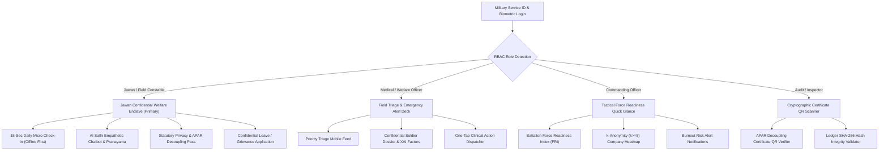

# RAKSHAK-AAYUSH (रक्षा-आयुष) Mobile Application Architecture & Implementation Plan
## Tactical Mobile Welfare & Stress Resilience System for Armed Forces (CRPF, BSF, ITBP & Indian Army)

---

### 1. Technology Selection: React Native (Expo) vs Flutter

#### **Recommendation: React Native (Expo SDK 51/52 with TypeScript)**
After evaluating system resources, existing codebase structure, and defense operational constraints:

| Evaluation Criteria | React Native (Expo) [RECOMMENDED] | Flutter (Dart) |
| :--- | :--- | :--- |
| **Current Machine Readiness** | **100% Ready** (Node.js v20.19.0 & npm already installed) | **Not Installed** (`flutter` command not found; requires ~2GB SDK & Gradle toolchains) |
| **Code & Logic Reusability** | **High** (Reuses API contracts, types, SHA-256 crypto, and Hindi/English dictionaries from `frontend/`) | **Zero** (Must rewrite all models, API handlers, and UI logic from scratch in Dart) |
| **Offline Storage in Border Areas** | **Native SQLite (`expo-sqlite`)** & SecureStore for air-gapped outposts | Needs `sqflite` with separate JNI bindings |
| **Instant Testing & Demonstration** | **Expo Go (QR scan)** + Web preview (`npx expo start --web`) for instant demo without Android Studio | Requires heavy Android Emulator / physical device debugging setup |
| **Biometric & Haptic Integration** | `expo-local-authentication` & `expo-haptics` for tactical breathing exercises | `local_auth` & plugin setup |

> **Conclusion**: React Native with Expo allows immediate development, zero external heavy SDK installation, 100% logic alignment with our FastAPI backend, and instant mobile deployment.

---

### 2. Mobile User Roles & Operational Scope

In tactical field operations, mobile devices are deployed at forward posts (BOPs, Ridge Outposts, Patrol Units). The mobile application provides role-tailored interfaces:



1. **Role 1: Jawan (Field Troop / Constable / Sub-Inspector) — Primary Mobile User**
   - **Trench-Ready 15-Second Daily Check-in**: Fast sliders for sleep, mood, exhaustion, and mental stress.
   - **Offline-First Synchronization**: Check-ins stored in encrypted local SQLite when patrolling zero-connectivity border zones; auto-synced upon reconnecting to outpost Wi-Fi/cellular.
   - **AI Sathi (एआई साथी)**: Multi-lingual AI companion trained to detect acute psychological distress cues with Tele-MANAS (14416) emergency linkage.
   - **Tactical Pranayama (4-7-8 Breathing)**: Interactive animated breathing circle with haptic pacing.
   - **APAR Decoupling Statutory Pass**: Digital cryptographic pass with official DGAFMS seal proving zero appraisal penalty.
   - **Confidential Emergency Leave Application**: Direct application to Base Medical Officer with instant status tracking.

2. **Role 2: Medical & Welfare Officer (Field Triage Mode)**
   - Urgent triage queue alert when a soldier flags critical stress or crisis keywords.
   - Soldier dossier review on mobile with Explainable AI (XAI) radar indicators.
   - Quick sanction of Rest & Recuperation (R&R) leaves or tele-counseling.

3. **Role 3: Commanding Officer (Tactical Readiness Mode)**
   - High-level Force Readiness Index (FRI) circular gauge.
   - Company burnout status with strict k-anonymity (no individual troop names shown).
   - Instant push alerts if an entire company approaches critical exhaustion.

4. **Role 4: Audit Admin (Cryptographic Validator Mode)**
   - Camera QR scanner to verify authenticity of Jawan Privacy Certificates.
   - Tamper-proof validation against backend audit ledger.

---

### 3. Detailed Phase-by-Phase Task & Mini-Task Breakdown

#### **PHASE 1: Project Scaffolding & Mobile Architecture**
- **Task 1.1: Mobile Application Workspace Setup**
  - **Mini-task 1.1.1**: Initialize clean Expo React Native project in `mobile/` directory with TypeScript.
  - **Mini-task 1.1.2**: Configure **Pure Black & White (Tactical Monochrome)** Design System:
    - Palette: Pure Obsidian Black (`#000000`), Stark Snow White (`#ffffff`), Charcoal borders (`#27272a`), Clean Ash Gray (`#71717a` / `#f4f4f5`).
    - Ultra high-contrast readability engineered for intense outdoor sunlight and zero-emission night-vision operations.
    - Zero flashy color gradients — purely functional, minimalist, military-grade monochrome cards, dividers, and typography.
  - **Mini-task 1.1.3**: Configure modular directory structure:
    ```
    mobile/
    ├── assets/              # Institutional crests, monochrome icons
    ├── src/
    │   ├── api/             # Axios client with JWT interceptor & retry engine
    │   ├── components/      # Monochrome UI cards, buttons, badges, sliders
    │   ├── context/         # AuthContext (with Biometrics), LanguageContext
    │   ├── i18n/            # Hindi & English defense dictionary
    │   ├── navigation/      # React Navigation role-based dynamic stacks
    │   ├── screens/
    │   │   ├── auth/        # Login & Fingerprint unlock screen
    │   │   ├── jawan/       # Check-in, AI Sathi, Certificate, Leave
    │   │   ├── welfare/     # Mobile triage queue, Dossier preview
    │   │   ├── commander/   # Readiness KPI, Company Heatmap glance
    │   │   └── audit/       # QR Scanner, Certificate validator
    │   ├── storage/         # Local SQLite database for offline sync
    │   └── utils/           # Timezone formatters (IST Asia/Kolkata), crypto
    ├── App.tsx              # Root component
    └── app.json             # Expo configuration
    ```
  - **Mini-task 1.1.4**: Setup `expo-secure-store` for hardware-encrypted JWT and biometric token retention.
  - **Mini-task 1.1.5**: Setup localized multi-lingual engine (`i18n`) supporting Hindi (`hi`) and English (`en`).

---

#### **PHASE 2: Authentication & Hardware Biometric (Fingerprint) Engine**
- **Task 2.1: Multi-Role Secure Login & Biometric Authentication**
  - **Mini-task 2.1.1**: Military credential login screen with Service ID / Username and Password in high-contrast Black & White.
  - **Mini-task 2.1.2**: Role auto-detection from JWT payload (`Jawan`, `Welfare Officer`, `Commanding Officer`, `Audit Admin`).
  - **Mini-task 2.1.3**: **Fingerprint Biometric Authentication Engine (`expo-local-authentication`)**:
    - Hardware sensor verification: Checks `hasHardwareAsync()` and `isEnrolledAsync()`.
    - Prominent tactile **"Touch Fingerprint Sensor to Unlock"** button with biometric icon.
    - Native Android BiometricPrompt / iOS TouchID integration.
    - On successful fingerprint match: securely extracts stored JWT token from `expo-secure-store` and authenticates instantly in <0.5 seconds without entering password.
    - Fallback mechanism: If fingerprint sensor is smudged/unavailable in forward muddy trenches, fallback to Service ID & PIN.
  - **Mini-task 2.1.4**: Quick Demo Role Switcher (for prototype testing across all 4 roles).
  - **Mini-task 2.1.5**: Secure session logout, auto-lock on app minimize, and biometric re-prompt.

---

#### **PHASE 3: Jawan Confidential Welfare Enclave (Primary Mobile Module)**
- **Task 3.1: 15-Second Daily Micro-Check-in (Offline First)**
  - **Mini-task 3.1.1**: Smooth tactile slider UI:
    - Mood Score (1-5 with descriptive Hindi/English labels)
    - Sleep Duration (Hours stepper: 2.0 to 12.0 hrs)
    - Sleep Quality (1-5 stars)
    - Physical Exhaustion (1-5 gauge)
    - Mental Stress Rating (1-5 slider)
  - **Mini-task 3.1.2**: Military-adapted PHQ-4 screener card (4 fast questions).
  - **Mini-task 3.1.3**: Voluntary confidential text journal with voice-to-text input option.
  - **Mini-task 3.1.4**: Offline Queue Engine: If device is offline, record is saved locally in SQLite with `is_offline_synced = False`. Background listener triggers auto-sync when network returns.
  - **Mini-task 3.1.5**: Immediate post-checkin feedback: Displays recalculated Stress Score, Resilience Tier, and personalized recovery advice.

- **Task 3.2: AI Sathi (एआई साथी) - Multi-Lingual Companion & Guided Pranayama**
  - **Mini-task 3.2.1**: Conversational chat interface styled for defense jawans (clean bubbles, fast response, Hindi & English).
  - **Mini-task 3.2.2**: Quick-action prompt chips ("रात की गश्त से थकान", "घर की याद आ रही है", "नींद नहीं आ रही", "प्राणायाम शुरू करें").
  - **Mini-task 3.2.3**: Crisis Keyword Interceptor: If NLP detects acute crisis markers, triggers immediate SOS banner with one-tap dialing to **Tele-MANAS (14416)** and **Base Medical Officer**.
  - **Mini-task 3.2.4**: Interactive 4-7-8 Tactical Breathing & Pranayama:
    - Expanding/contracting animated visual breathing circle (Inhale 4s -> Hold 7s -> Exhale 8s).
    - Haptic pulses on phase transitions (`expo-haptics`) so jawans can practice in pitch darkness.

- **Task 3.3: Statutory Medical Privacy & APAR Decoupling Certificate Pass**
  - **Mini-task 3.3.1**: Official Government of India / DGAFMS Digital Certificate Pass:
    - National Emblem / Defense crest styling.
    - Soldier details (Name, Service No., Unit).
    - Cryptographic verification token (SHA-256).
    - Issue Date formatted in Indian Standard Time (`IST`).
  - **Mini-task 3.3.2**: Dynamic QR Code containing verifiable cryptographic hash.
  - **Mini-task 3.3.3**: Statutory Non-Punitive Guarantee text in bilingual format.
  - **Mini-task 3.3.4**: "Download PDF Pass" / "Save to Photos" for offline presentation during inspection.

- **Task 3.4: Confidential Leave Request & Personal Welfare History**
  - **Mini-task 3.4.1**: Confidential leave application form:
    - Leave Type selector (Emergency R&R, Casual Leave, Compassionate Leave).
    - Date range pickers (Start Date, End Date).
    - Personal reason input with Emergency Welfare Grievance toggle.
  - **Mini-task 3.4.2**: Real-time Leave Status Card (Pending, Sanctioned, Deferred).
  - **Mini-task 3.4.3**: Historical Trends tab showing 14-day stress score progression, sleep hours curve, and previous micro-checkins.

---

#### **PHASE 4: Medical & Welfare Officer Mobile Field Care Desk**
- **Task 4.1: Priority Clinical Triage Mobile Deck**
  - **Mini-task 4.1.1**: Real-time Triage List ranked by clinical urgency (Critical cases at top).
  - **Mini-task 4.1.2**: Filtering by Operational Company (Alpha, Bravo, Charlie, Delta) and Risk Tier.
  - **Mini-task 4.1.3**: Crisis Alert Banner displaying soldiers with keyword alerts.
  - **Mini-task 4.1.4**: Soldier Dossier Modal:
    - 5-Factor XAI stress driver breakdown (Duty hours, deployment fatigue, sleep debt, leave cancellations, psychometrics).
    - Historical check-in notes and biometrics.
  - **Mini-task 4.1.5**: Action Dispatcher: One-tap button to sanction Rest & Recuperation (R&R) or dispatch counseling session.

---

#### **PHASE 5: Tactical Commander Mobile Snapshot**
- **Task 5.1: High-Level Operational Readiness Quick Glance**
  - **Mini-task 5.1.1**: Force Readiness Index (FRI) circular progress gauge & battalion health score.
  - **Mini-task 5.1.2**: Risk distribution breakdown (Resilient %, Fatigued %, Vulnerable %, Critical %).
  - **Mini-task 5.1.3**: Company Heatmap cards with strict k-anonymity ($k \ge 5$) suppression.
  - **Mini-task 5.1.4**: Mobile Executive Briefing view with digital signature hash and IST generation time.

---

#### **PHASE 6: Audit & Governance Mobile Validator**
- **Task 6.1: Certificate Verification & Integrity Scanner**
  - **Mini-task 6.1.1**: Camera-based QR Code Scanner for scanning Jawan APAR certificates.
  - **Mini-task 6.1.2**: Live verification against backend SHA-256 audit ledger.
  - **Mini-task 6.1.3**: Displays tamper status (`VERIFIED_UNCOMPROMISED` or `TAMPER_DETECTED`).
  - **Mini-task 6.1.4**: Real-time compliance scorecards (DPDPA Section 14, k-Anonymity compliance).

---

#### **PHASE 7: Offline Resilience, Testing & Demonstration**
- **Task 7.1: Zero-Network Outpost Testing & Final Polish**
  - **Mini-task 7.1.1**: Offline Border Patrol Simulation: Submit check-in with Wi-Fi/mobile data off -> verify stored in local SQLite -> reconnect -> verify automatic sync to backend.
  - **Mini-task 7.1.2**: Live integration testing connecting mobile client to `http://<LAN-IP>:8000`.
  - **Mini-task 7.1.3**: Hindi/English language toggle persistence.
  - **Mini-task 7.1.4**: Expo Web & Android APK build script verification.

---

### 4. Implementation Rules & Guarantees
1. **Web Portal Isolation**: The `frontend/` directory (Next.js web portal) is strictly frozen. No files in `frontend/` or `backend/` will be broken or modified.
2. **Dedicated Mobile Directory**: All mobile application code will reside exclusively in `mobile/`.
3. **API Harmony**: The mobile app consumes the existing FastAPI backend (`/api/auth`, `/api/jawan`, `/api/welfare`, `/api/commander`, `/api/audit`), requiring zero backend regressions.
4. **Timezone Fidelity**: All dates and timestamps in the mobile app strictly format in Indian Standard Time (`Asia/Kolkata` / `IST`).
